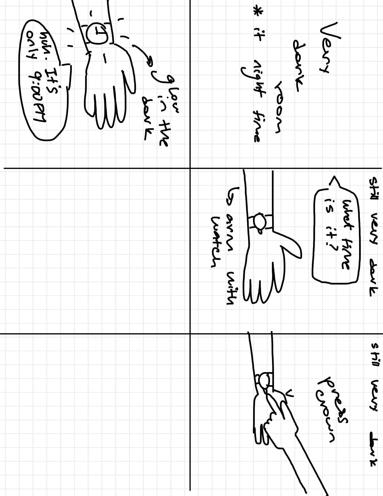
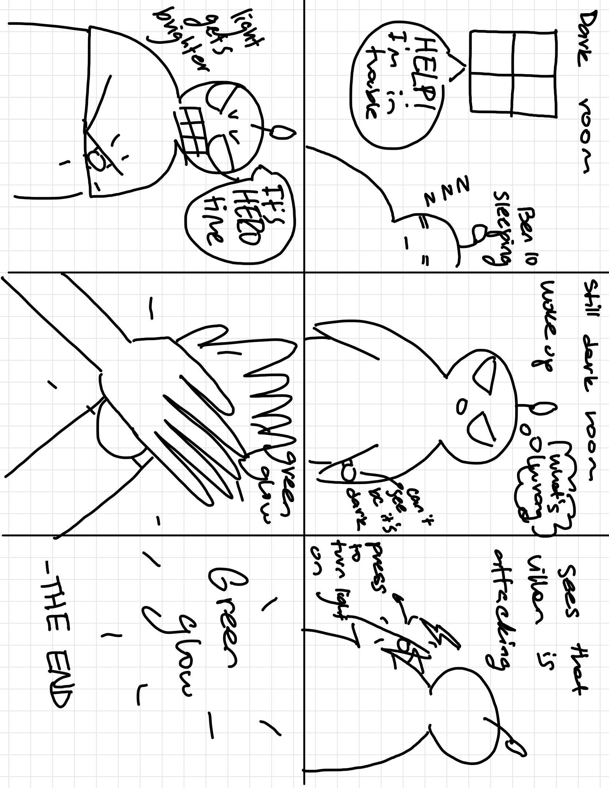
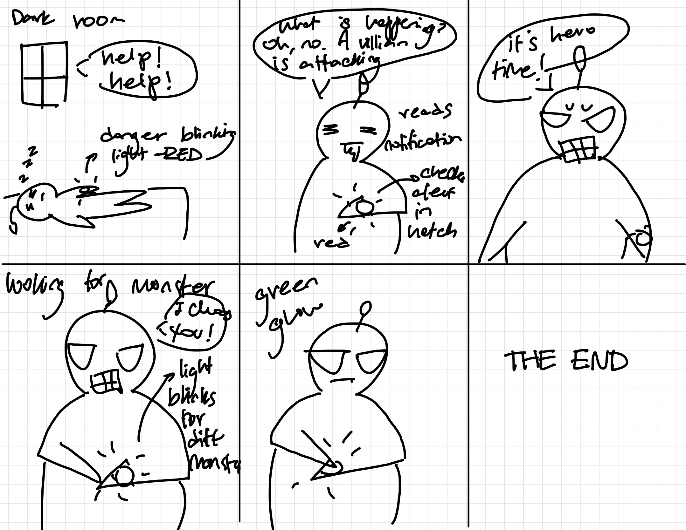
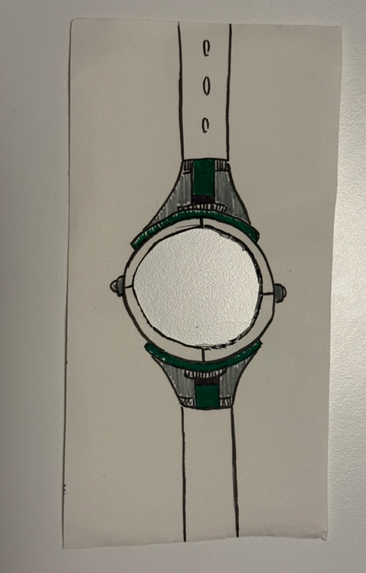

# Recreating the Masters of Interactive Light

_This project is to be done in teams of 2._

**NAME OF BOTH COLLABORATOR(S) HERE: Marisol Park (mp2365) and Neeha Ravula (nr485)**

**THE MASTERWORK YOU DREW FROM THE HAT: Timex Indiglo 1992**

[**LINK TO ORIGINAL LAB GITHUB PAGE: https://github.com/IRL-CT/Interactive-Lab-Hub/blob/HEAD/Lab%201/README.md](https://github.com/IRL-CT/Interactive-Lab-Hub/blob/HEAD/Lab%201/README.md)

---
<!-- 
One way to understand greatness is to look to the greats. Just as painters learn
the technique and artistry of the old masters by recreating their paintings, so
too shall we come to understand computer-mediated interaction by recreating the
interactive masterworks of our time.

This week, every team will draw a different masterwork from a hat. Some are
conceptual pieces, some are historical works, some are modern-day products —
but they all share one thing: **their central mode of interaction is carried by
light.** Think of Tinker Bell in the original stage production of *Peter Pan*,
represented by nothing more than a darting circle of light from an off-stage
mirror. There was no actor playing Tinker Bell; she existed entirely through the
way the other characters interacted with that light.

Your job is to recreate the *interaction* of the piece you drew — not to build a
museum-grade replica, but to stage the moment that makes it what it is. Someone
who knows your piece should watch your recreation and recognize it instantly.
Someone who has never heard of it should walk away understanding what it is
famous for.

You will do this using the interaction staging techniques we will use all semester: a
storyboard, some acting, a phone standing in as a controllable light (the
*Tinkerbelle* tool), a hidden human "wizard" driving it, a costume, and a
recorded video.

*Make sure you read all the instructions and understand the whole activity
before starting!*

## Prep

To start, you will need:

1. Read about Git [here](https://git-scm.com/book/en/v2/Getting-Started-What-is-Git%3F).
2. Set up your own Github "Lab Hub" by forking the [Interactive-Lab-Hub repository](https://github.com/IRL-CT/Interactive-Lab-Hub). To get lab updates, simply use [GitHub's "Sync fork" button](https://docs.github.com/en/pull-requests/collaborating-with-pull-requests/working-with-forks/syncing-a-fork) when new content is available.

3. Set up your `README.md` so it has your name and links to this lab. Learn to
   format a README [here](https://docs.github.com/en/get-started/writing-on-github/getting-started-with-writing-and-formatting-on-github/basic-writing-and-formatting-syntax).
4. **Draw your masterwork from the hat and write it at the top of this file.**
   Whatever you drew is yours — lean into it.
-->
<!--
## Materials

For this lab you will need:

1. Paper, markers/pens, scissors
2. A smartphone with a browser that can display a webpage (your stand-in "light")
3. A computer to host the control webpage
4. Found objects and materials to **costume your phone so it looks like the
   device in your masterwork** — doll clothes, a paper lantern, a bottle, foil,
   a cardboard shell, whatever it takes. Be resourceful.

## Deliverables

Submit all of the following in this lab folder of your Lab Hub, as links or
uploaded files. **Each group member posts their own copy to their own Github repo**, even if the work is
shared.

1. A short **research write-up** of your masterwork (what it is, when, who made
   it, and — most importantly — what the interaction is)
2. **3 iterated storyboards** of the interaction in the masterwork
5. A **video sketch** of your prototyped interaction
6. Any **reflections** on the process

Labs are due on Mondays. Make sure this page is linked from your main class hub
page.
-->
---

# The Report

## Part 0. Know Your Master
<!-- 
Before you prototype anything, get intimately acquainted with the piece you
drew. Do real research. You are looking less for trivia than for the *shape of
the interaction*:

- What inputs are available to the user? What responses does the work give?
- Who is present, and how does the piece color the relationships between them?
- What is the piece famous for? What are its strengths and its weaknesses?

  Sometimes the details of how the interaction worked are lost in history. Try filling it in with your imagination!

**Describe your masterwork here, in your own words. What is the core interaction
someone would recognize it by?**
-->

The Timex Indiglo watches were initially released in 1992 by the company Timex as their response to the major challenges that came with trying to read a watch in the dark. These devices allowed users to simply tap the crown on the side, which would trigger the electroluminescent technology that backlit the dial, and easily read the time. No need to get up and switch on a light or move around to a better lit place.

The biggest strengths of these watches were that they offered a long-lasting, safe way to read the time in low light. Based on the Hodinkee article, "In-DepthShining A Light On Timex Indiglo," pre-Indiglo technology, watchmakers discovered that a mix of radium and zinc sulfide could also create a glow-in-the-dark effect in the dial. However, this would quickly wear off and expose users to radioactive danger. Instead, Timex came up with a solution that solved all three problems: electroluminescent panels. 

Sources:
- [Indiglo: A Luminous History](https://timex.com/blogs/the-timex-blog/indiglo%C2%AE-a-luminous-history)
- [In-DepthShining A Light On Timex Indiglo](https://www.hodinkee.com/articles/shining-a-light-on-timex-indiglo)
- [Timex Indiglo two watches commercial 1993](https://www.youtube.com/watch?v=XZMk6H3UkDs)

## Part A. Plan
<!-- 
For your masterwork, reconstruct the interaction as a scene:

- **Setting:** Where and when does this interaction happen? (a jungle, a kitchen,
  a spaceship corridor, a nightclub, a harbor at night)
- **Players:** Who is involved? Who else is present? Think through everyone in
  the setting, not just the primary user.
- **Activity:** What is happening between the players and the light?
- **Goals:** What is each player trying to do?

**Describe your setting, players, activity, and goals here.**

Now **sketch a 3 storyboards** of the interaction you are recreating. (The number may depend on the thing you drew, but stretch your thinking!) They
don't need to be beautiful, but they must capture and communicate not only the behavior of the light, but how it affects
and the people around it. If you're new to storyboarding, read
[this explanation](https://www.nngroup.com/articles/storyboards-visualize-ideas/).

**Include pictures of your storyboards here.**

Use the storyboards to decide what interaction to prototype.

**Summarize the feedback you got here.**
-->

**Basic Info**
Setting : In a dark room at night
Players : The watch user (Ben 10), a person asking for help from a distance, and the hidden operator controlling the light on cue
Activity: Ben 10 is woken up by his blinking watch, informing him about a villain’s attack nearby (he can also hear the distant screams from someone). He checks his watch in the dark to learn more about the attack. Then, he decides it is time to help and twists the crown of his watch to transform into a hero. 
Goal    : Show that the glow-in-the-dark feature (Indiglo) in Ben's watch allows him to quickly stay informed about the situation at hand and select the correct alien to transform into. All without having to waste time turning on his light. 

**Story boards**

***Iteration 1: copy of add***
Showing simple action and reaction of the Indiglo watch. Press the crown and the dial lights up, allowing the user to easily read the time in the dark.

***Iteration 2: Our version (Ben Ten themed)***
Adding our fun twist with some inspiration from Ben 10, we came up with a storyline that would feature him using the watch in the dark.

***iteration 3: changes after acting out the scene one time***
After acting out the interaction and playing around with the Tinkerbell tool, we noticed some of the restrictions we would have to work on. To accommodate these, we decided to minimize the angles (only front angles) and adjust the light feedback to fit what Tinkerbell could do.

**Feedback**
placeholder

## Part B. Act out the Interaction
<!-- 
Physically act out the interaction you planned. For now, just pretend the light
is doing what you've scripted — a person can wave a flashlight, or you can narrate
it aloud.

**Are there things that seemed better on paper than when acted out?**

**Did new ideas about the piece surface once you were on your feet?**

**Are there key moments in the interaction where things could go in a different direction?**
Iterate your storyboards to capture key non-sequential aspects of the interaction. 

-->
After acting out the sequence we discovered:
- We noticed that we needed to add a reason that would lead the player to check their watch
- We decided we would need to use 2 colors, red and green, to differentiate the different feedback the watch was giving the user (red for warning / green for alien selection)
- We also concluded that since we would be using a zoom recording to record the interaction, we would need to change some of the angles in the video so that the light from the "watch" was visible
- We realized that to make the alien selection more realistic, we would need to add some changes in light brightness to communicate how Ben was looking through aliens before making a selection
- This is all reflected in the last storyboard above

## Part C. Prototype the Light (light first!)
<!-- 
Use your smartphone as the light of your device. Open the browser on your phone
to act as the "light," and use the remote control interface on your computer to
change that light. Code and setup instructions for the *Tinkerbelle* tool are
[here](https://github.com/IRL-CT/tinkerbelle) (we invented this tool for
this lab). If you hit technical trouble, a manually or remotely controlled light
switch, dimmer, or lamp is a fine substitute.

**Get the light interaction working before anything else.** Your grade this week
rides on the *light* being recognizable — the color, the rhythm, the timing, the
way it answers a person. Only once your light interaction genuinely reads as your
masterwork should you consider layering in a second modality (sound, vibration,
motion). If in doubt, keep polishing the light. The other modalities are next
week's business.
-->
For this week, we focused on the light interactions by themselves.

For this project, we used the Tinkerbell tool, with the phone acting as the watch and the computer acting as the controller for the interactions. We used different color swatches (green/red) to communicate different actions with the watch and used the slider to manage the brightness of the light. 

Tinkerbell feedback: We were able to make the tool work for our story. However, we would have benefited from a designated brightness slider and the ability to set our own custom color swatches. 

## Part D. Wizard the Device
<!-- 
Set up a "wizard" arrangement so one person can secretly drive the light while
another acts with it — this is how you make the device feel alive without
building any real electronics. (Zoom works well for recording; you can pin the
video feed of whichever scene you want to capture.)

**Include your first attempts at recording the wizarded set-up here.**
-->

We recorded the video in Zoom, with one of us acting as Ben 10 interacting with the watch, and the other off-camera controlling the light so that it coordinated with Ben's movements.
[First attempt (take 1): https://youtu.be/42269kgHxoI](https://youtu.be/42269kgHxoI)

## Part E. (optional) Costume the Device
<!-- 
Only now should you worry about what the device looks like. Costume your phone so it reads
as the object from your masterwork — HAL's eye, a Simon shell, a paper-lantern
Tinker Bell, an Ambient Orb, a lighthouse, a jack-o'-lantern, whatever you drew.

Think about the world your device lives in: could that environment overheat it?
Is water a danger? Does it need to be loud and bright for an emergency, or quiet
and calm for a bedroom?

**Include sketches/photos of what your device might look like here.**

**What concerns or opportunities shaped the way you designed its look?**
-->

We wanted the phone to look more like a watch to bring it closer to the real experience of using the device as it was meat to be. 

Photo of our "custome" (making the phone look like a watch):

## Part F. Record
<!-- 
**Record your prototyped interaction as a video sketch.** Aim for the bar from
the top of this lab: a viewer who knows the piece should recognize it; a viewer
who doesn't should come away understanding what it's famous for. How might you illustrate the non-sequential aspects of the interaction in the sketch?

**Include your video here.**

**Please indicate who you collaborated with on this lab.** Be generous in
acknowledging their contributions, and credit any other influences (YouTube,
Github, Twitter, a friend who lent you a lamp) that informed your recreation.
-->

[Final attempt (take 7): https://youtu.be/3fDFrM_SdIQ](https://youtu.be/3fDFrM_SdIQ)

Collaborators:
- Neeha Ravula (wizard controller & person in danger)
- Marisol Park (Ben 10)
- Inspirations from Ben 10 cartoon

---

# Part 2 — ReMastering the light

*This describes the second week's work for this lab activity.*

## Prep (before the next lab)

Find three other groups. (How? Maybe Slack?) Visit their Lab Hub pages, watch their
videos, and give them reactions and feedback: tell them what you saw happening,
guess the masterwork and the goals of the characters, and ask about anything that
wasn't clear.

**Who were the other groups you kibitzed with? Add links to their project pages here.**
**Summarize the feedback you got from your partners here.**

## Remix, Update, or Critique the Master

Now that you understand your masterwork from the inside, respond to it. Do the
recreation again, but this time make it your own — pick one of these moves (or
combine them):

1. **Remix the modality.** Your recreation no longer has to (just) use light. Use
   vibration, sound, motion, heat — whatever best carries the interaction. Feel
   free to fork and modify the Tinkerbelle code. (Add your updates to this lab's folder!)
2. **Update it.** Redesign the piece for today's context, or for a setting its
   creators never imagined (the piece with roommates in the room, with children
   present, on a phone, in a car).
3. **Fix its weaknesses.** You identified this master's strengths and weaknesses
   in Part 0 — now address a weakness, or push a strength further.

We will grade this second pass with an emphasis on **creativity** and on how well
your response engages with what your master was really doing.

**Document everything here — especially the storyboard and video. Photos of the
prototype are great too.**

---

*Assignment lineage: this lab merges "Staging Interaction" (Interactive Lab Hub)
with "Recreating the Masters" (Interaction Design Studio, Profs. Scott Minneman &
Wendy Ju). Massive list of interactive light masterworks generated by Claude.ai.*
